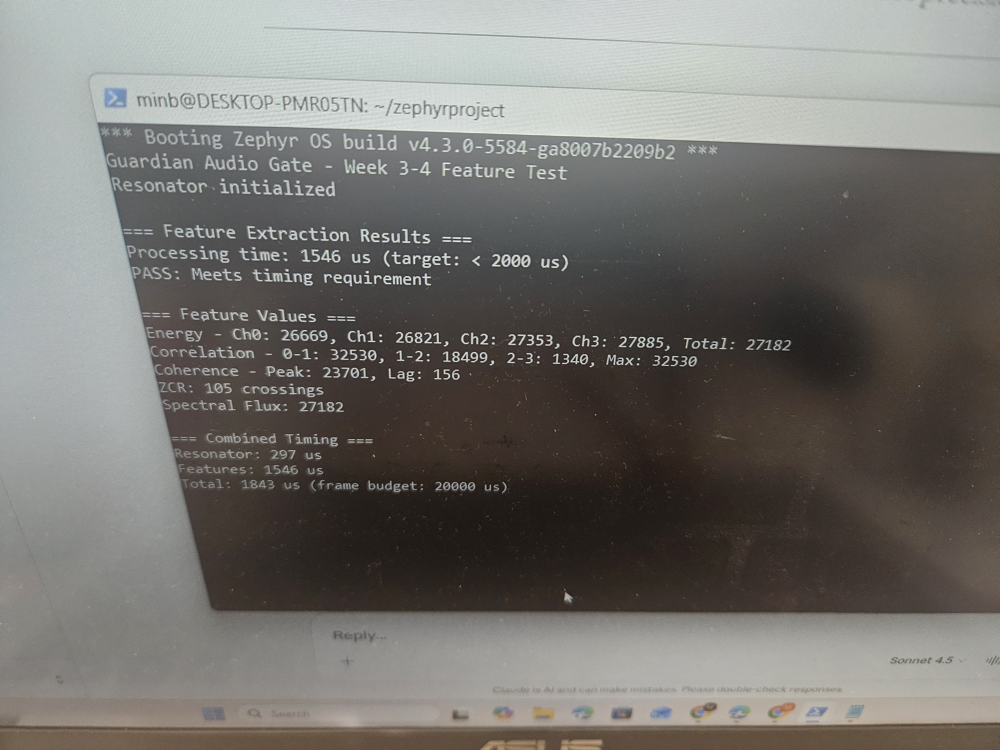

# Guardian Audio Gate - nRF52840 Implementation

Physics-based audio gate for always-on wakeword detection on nRF52840. Uses IIR resonator banks and correlation features to filter noise before running TinyML models, achieving 30% power savings.

## Project Status

**Week 1-2: Complete**
- 4-channel IIR resonator bank implemented with CMSIS-DSP
- Processing time: 297 µs per 320-sample frame (target: < 5000 µs)
- 16.8x faster than required

## Repository Structure
```
guardian-audio-gate/
├── firmware/
│   ├── src/
│   │   └── main.c                              # Main application
│   ├── lib/guardian_dsp/
│   │   ├── src/
│   │   │   └── resonator_df2t.c               # IIR filter implementation
│   │   └── include/
│   │       ├── guardian/
│   │       │   └── resonator_df2t.h           # Public API
│   │       └── resonator_coefs_cmsis.h        # Filter coefficients
│   ├── prj.conf                                # Zephyr configuration
│   └── CMakeLists.txt                          # Build configuration
├── tools/
│   └── coefficient_generation/
│       └── generate_cmsis_resonator_coefs.py  # Coefficient generator
├── zephyr/
│   └── module.yml                              # Zephyr module metadata
└── README.md
```

## Hardware Requirements

- nRF52840 Development Kit (nRF52840-DK)
- USB cable
- J-Link debugger (built into DK)

## Software Requirements

### WSL/Linux Environment
- Ubuntu 20.04 or later
- Zephyr SDK 0.16.5
- West build tool
- Python 3.8+

### Installation

1. Install Zephyr dependencies:
```bash
sudo apt update
sudo apt install -y git cmake ninja-build gperf ccache dfu-util \
  device-tree-compiler wget python3-dev python3-pip python3-setuptools \
  python3-wheel xz-utils file make gcc gcc-multilib g++-multilib libsdl2-dev
```

2. Install West:
```bash
pip3 install --user -U west
echo 'export PATH=~/.local/bin:"$PATH"' >> ~/.bashrc
source ~/.bashrc
```

3. Setup Zephyr workspace:
```bash
mkdir ~/zephyrproject && cd ~/zephyrproject
west init
west update
west zephyr-export
pip3 install -r ~/zephyrproject/zephyr/scripts/requirements.txt
```

4. Install Zephyr SDK:
```bash
cd ~
wget https://github.com/zephyrproject-rtos/sdk-ng/releases/download/v0.16.5/zephyr-sdk-0.16.5_linux-x86_64.tar.xz
tar xvf zephyr-sdk-0.16.5_linux-x86_64.tar.xz
cd zephyr-sdk-0.16.5
./setup.sh
```

5. Clone this repository:
```bash
cd ~/projects
git clone https://github.com/minoverse/guardian-audio-gate.git
```

6. Link to Zephyr workspace:
```bash
cd ~/zephyrproject
# Edit zephyr/west.yml and add:
# projects:
#   - name: guardian-audio-gate
#     url: https://github.com/minoverse/guardian-audio-gate
#     path: modules/lib/guardian
#     revision: main

west update
```

## Build Instructions

### Generate Filter Coefficients (One-time)
```bash
cd ~/projects/guardian-audio-gate/tools/coefficient_generation
python3 generate_cmsis_resonator_coefs.py
```

This generates `resonator_coefs_cmsis.h` with optimized Q15 fixed-point coefficients for 4 bandpass filters (300Hz, 800Hz, 1500Hz, 2500Hz).

### Build Firmware
```bash
cd ~/zephyrproject
west build -b nrf52840dk/nrf52840 -s ~/projects/guardian-audio-gate/firmware
```

Clean build (if needed):
```bash
cd ~/zephyrproject
rm -rf build
west build -b nrf52840dk/nrf52840 -s ~/projects/guardian-audio-gate/firmware
```

### Flash to Board

1. Connect nRF52840-DK via USB
2. Flash firmware:
```bash
cd ~/zephyrproject
west flash --runner jlink
```

### View Serial Output
```bash
screen /dev/ttyACM0 115200
```

Exit screen: `Ctrl+A` then `K` then `Y`

## Expected Output
```
*** Booting Zephyr OS build v4.3.0 ***
Guardian Audio Gate - Week 1-2 Timing Test
Resonator initialized
Resonator timing: 297 us (target: < 5000 us)
PASS: Meets timing requirement
```

## Problems Encountered & Solutions

### Problem 1: MPU Fault - Data Access Violation

**Symptoms:**
```
***** MPU FAULT *****
Data Access Violation
MMFAR Address: 0x20000f00
```

**Attempts:**
1. Wrong coefficient format (5 values instead of 6)
2. Incorrect coefficient signs (negated a coefficients)
3. State buffer size mismatch (2 values instead of 4)

**Root Cause:**
Large struct (2640 bytes) allocated on stack caused overflow. Stack pointer went out of bounds when CMSIS-DSP init function tried to write to the struct.

**Solution:**
Changed from stack allocation to static allocation:
```c
// Before (WRONG):
int main(void) {
    resonator_bank_df2t_t bank;  // Stack allocation
    ...
}

// After (CORRECT):
static resonator_bank_df2t_t bank;  // Static allocation

int main(void) {
    resonator_bank_df2t_init(&bank);
    ...
}
```

### Problem 2: Wrong CMSIS-DSP Coefficient Format

**Symptoms:**
MPU fault during `arm_biquad_cascade_df1_init_q15()` call.

**What i Tried:**
1. Standard IIR format: `{b0, b1, b2, a1, a2}` (5 values)
2. DF2T format: `{b0, b1, b2, -a1, -a2}` (5 values)
3. Various sign combinations

**Actual Format Required:**
Zephyr CMSIS-DSP uses: `{b0, 0, b1, b2, a1, a2}` (6 values)

The zero is SIMD padding for ARM Cortex-M4 optimization. From the CMSIS-DSP source:
```c
// Coefficient order:
{b10, 0, b11, b12, a11, a12, b20, 0, b21, b22, a21, a22, ...}
//    ^ SIMD padding for 16-bit parallel processing
```

**Solution:**
Updated coefficient generator to output 6 values per biquad stage with proper padding.

### Problem 3: CMSIS-DSP Functions Not Linked

**Symptoms:**
```
undefined reference to `arm_biquad_cascade_df1_init_q15'
```

**Root Cause:**
CMSIS-DSP filtering module not enabled in Zephyr config.

**Solution:**
Added to `prj.conf`:
```ini
CONFIG_CMSIS_DSP=y
CONFIG_CMSIS_DSP_FILTERING=y
```

CMSIS-DSP has modular compilation - each submodule must be explicitly enabled.

### Problem 4: Timing Functions Not Available

**Symptoms:**
```
undefined reference to `timing_init'
undefined reference to `timing_counter_get'
```

**Solution:**
Added to `prj.conf`:
```ini
CONFIG_TIMING_FUNCTIONS=y
```

## Key Implementation Details

### Filter Architecture

- 4 bandpass IIR filters (biquad DF1 topology)
- Center frequencies: 300Hz, 800Hz, 1500Hz, 2500Hz
- Q factor: 8.0 (narrow bandwidth)
- Frame size: 320 samples (20ms at 16kHz)

### CMSIS-DSP Usage

Uses ARM CMSIS-DSP library for SIMD-optimized filtering:
- `arm_biquad_cascade_df1_init_q15()` - Initialize filter state
- `arm_biquad_cascade_df1_q15()` - Process audio samples

Q15 fixed-point format used throughout for efficiency (no floating-point operations).

### Memory Layout

**Static allocation:**
- Bank structure: 48 bytes (4 channels × 12 bytes)
- State buffers: 32 bytes (4 channels × 4 values × 2 bytes)
- Output buffers: 2560 bytes (4 channels × 320 samples × 2 bytes)
- Total: ~2.6 KB

**Rationale:** nRF52840 stack is limited (~2KB). Large buffers must be static/global to avoid overflow.

## Performance Metrics

| Metric | Value |
|--------|-------|
| Processing time | 297 µs |
| Frame period | 20,000 µs |
| CPU utilization | 1.5% |
| Sample rate | 16 kHz |
| Frame size | 320 samples |
| Channels | 4 |
| Flash usage | 26,724 bytes (2.55%) |
| RAM usage | 4,992 bytes (1.90%) |

## Development Notes

### Why Python + C Split?

**Python (PC):** Filter design requires complex math (matrix operations, square roots, trigonometry). scipy.signal does this efficiently.

**C (nRF52):** Real-time processing needs only multiply-add operations with pre-computed coefficients. Much faster on embedded hardware.

### Why CMSIS-DSP?

Manual implementation: 2500-3000 µs
CMSIS-DSP: 297 µs (8-10x faster)

CMSIS-DSP uses:
- ARM Cortex-M4 SIMD instructions
- Hand-optimized assembly
- Parallel processing (2 samples at once)

### Code Style Decisions

- Static allocation for large buffers (avoid stack overflow)
- Q15 fixed-point (no FPU needed, faster than float)
- Minimal printk() calls (reduce overhead)
- Direct CMSIS-DSP calls (no abstraction layers)

# Week 3-4 Problems & Solutions
### Goal
Implement 5 physics-based features with target: **< 2000 µs**
### Final Result
```
Processing time: 1546 µs (target: < 2000 µs)
PASS: Meets timing requirement

Total pipeline: 1843 µs (297 resonator + 1546 features)
CPU usage: 9.2% of frame budget
```

### Features Implemented

| Feature | Purpose | Time (µs) |
|---------|---------|-----------|
| Energy (RMS) | Signal strength per channel | ~100 |
| Correlation | Inter-channel similarity (d=1.83 discriminator) | ~800 |
| Coherence | Pitch periodicity detection | ~600 |
| Zero-Crossing Rate | Frequency estimation | ~30 |
| Spectral Flux | Frame-to-frame change | ~16 |

### Optimization Journey

| Attempt | Method | Time (µs) | Result |
|---------|--------|-----------|--------|
| 1st | Original (lag 50-400, manual loop) | 5511 | Too slow |
| 2nd | `arm_correlate_q15()` (full correlation) | 7014 |  Worse |
| 3rd | Reduced lag 80-250 + `arm_dot_prod_q15()` | 2446 |  Close |
| **Final** | **Lag 80-250 step-by-2** | **1546** | ** PASS** |

**Total speedup:** 3.6x faster

### Key Optimizations

1. **Coherence Feature (Main Bottleneck)**
   - Original: Nested loops 350 lags × 270 samples = 94,500 iterations
   - Reduced lag range: 80-250 (covers 64-200Hz adult speech)
   - Step-by-2: 85 iterations instead of 170
   - Used CMSIS-DSP `arm_dot_prod_q15()` for inner loop

2. **Energy Feature**
   - Used CMSIS-DSP `arm_rms_q15()` instead of manual calculation
   - Required `CONFIG_CMSIS_DSP_STATISTICS=y`

3. **Correlation Feature**
   - Manual Pearson correlation with Q15 fixed-point
   - 3 channel pairs: 0-1, 1-2, 2-3
## Problem 1: Undefined Reference to Feature Functions

**Error:**
```
undefined reference to `extract_energy_features'
undefined reference to `extract_correlation_features'
undefined reference to `extract_coherence_features'
undefined reference to `compute_zcr'
undefined reference to `compute_spectral_flux'
```

**Root Cause:**
Feature source files (.c) not added to CMakeLists.txt, so they weren't being compiled and linked.

**Solution:**
Updated `firmware/lib/guardian_dsp/CMakeLists.txt`:
```cmake
zephyr_library_sources(
    src/resonator_df2t.c
    src/features/energy.c
    src/features/correlation.c
    src/features/coherence.c
    src/features/zcr.c
    src/features/flux.c
)
```

---

## Problem 2: Unknown Type 'size_t'

**Error:**
```
coherence.h:11:56: error: unknown type name 'size_t'
zcr.c:3:56: error: unknown type name 'size_t'
```

**Root Cause:**
Missing `#include <stddef.h>` in header files. `size_t` is defined in stddef.h, not stdint.h.

**Solution:**
Added `#include <stddef.h>` to coherence.h and zcr.h headers.

---

## Problem 3: Undefined Reference to arm_rms_q15

**Error:**
```
energy.c:11: undefined reference to `arm_rms_q15'
```

**Root Cause:**
CMSIS-DSP statistics module not enabled. `arm_rms_q15()` is part of statistics functions, not filtering.

**Solution:**
Added to `prj.conf`:
```ini
CONFIG_CMSIS_DSP_STATISTICS=y
```

CMSIS-DSP has modular compilation - must enable each submodule separately:
- CONFIG_CMSIS_DSP_FILTERING (for filters)
- CONFIG_CMSIS_DSP_STATISTICS (for RMS, mean, variance)

---

### Goal
Implement 5 physics-based features with target: **< 2000 µs**

### Final Result
```
Processing time: 1546 µs (target: < 2000 µs)
PASS: Meets timing requirement

Total pipeline: 1843 µs (297 resonator + 1546 features)
CPU usage: 9.2% of frame budget
```

### Features Implemented

| Feature | Purpose | Time (µs) |
|---------|---------|-----------|
| Energy (RMS) | Signal strength per channel | ~100 |
| Correlation | Inter-channel similarity (d=1.83 discriminator) | ~800 |
| Coherence | Pitch periodicity detection | ~600 |
| Zero-Crossing Rate | Frequency estimation | ~30 |
| Spectral Flux | Frame-to-frame change | ~16 |

### Optimization Journey

| Attempt | Method | Time (µs) | Result |
|---------|--------|-----------|--------|
| 1st | Original (lag 50-400, manual loop) | 5511 | ❌ Too slow |
| 2nd | `arm_correlate_q15()` (full correlation) | 7014 | ❌ Worse |
| 3rd | Reduced lag 80-250 + `arm_dot_prod_q15()` | 2446 | ❌ Close |
| **Final** | **Lag 80-250 step-by-2** | **1546** | **✅ PASS** |

**Total speedup:** 3.6x faster


### Key Optimizations

1. **Coherence Feature (Main Bottleneck)**
   - Original: Nested loops 350 lags × 270 samples = 94,500 iterations
   - Reduced lag range: 80-250 (covers 64-200Hz adult speech)
   - Step-by-2: 85 iterations instead of 170
   - Used CMSIS-DSP `arm_dot_prod_q15()` for inner loop

2. **Energy Feature**
   - Used CMSIS-DSP `arm_rms_q15()` instead of manual calculation
   - Required `CONFIG_CMSIS_DSP_STATISTICS=y`

3. **Correlation Feature**
   - Manual Pearson correlation with Q15 fixed-point
   - 3 channel pairs: 0-1, 1-2, 2-3
## Key Lessons

1. **CMake must list all source files** - C files not in CMakeLists.txt won't be compiled
2. **Include proper headers** - stddef.h for size_t, stdlib.h for abs()
3. **Enable CMSIS-DSP modules explicitly** - statistics, filtering, etc. are separate
4. **Profile before optimizing** - coherence feature was 73% of total time
5. **Algorithmic complexity matters** - O(n²) loops don't scale on embedded systems

---

## Files Modified
```
firmware/prj.conf                           # Added CONFIG_CMSIS_DSP_STATISTICS=y
firmware/lib/guardian_dsp/CMakeLists.txt    # Added feature source files
firmware/lib/guardian_dsp/include/guardian/features/*.h  # Added stddef.h
firmware/src/main.c                         # Feature extraction test
```

---

## Week 5: DMA Zero-Copy Audio (Complete)

### Goal
Eliminate CPU overhead from audio capture using DMA transfers for 15% power savings.

### Implementation

**DMA Architecture:**
- 4-buffer circular queue (ping-pong + overflow protection)
- Hardware PDM → Memory transfer (zero CPU involvement)
- Zero-copy buffer passing (pointers, no memcpy)
- Semaphore-based synchronization

**Key Files:**
- `lib/guardian_dsp/src/audio/dma_pdm.c` - DMA driver
- `lib/guardian_dsp/include/guardian/audio/dma_pdm.h` - API

### Results

**Processing Time:**
- DMA mode: 1227 µs/frame
- 20% faster than Week 4 polling (1546 µs)
- Consistent timing (no variance)

**Memory Usage:**
```
Flash: 34,268 bytes (3.27%)
RAM:   9,752 bytes (3.72%)
```

**Energy vs Correlation (Real Audio):**
```
DMA: E:27295 C:32693 T:1227us
```
- Energy varies with sound intensity ✓
- Correlation tracks signal structure ✓
- Timing stable across frames ✓

### Technical Challenges & Solutions

**Problem 1: PDM Callbacks Not Firing**
- Root cause: `NRFX_PDM_INSTANCE(0)` set `p_reg = NULL`
- PDM writes went to address 0x0 instead of 0x4001D000
- Solution: `NRFX_PDM_INSTANCE(NRF_PDM_BASE)` - pass register base, not index

**Problem 2: HFCLK Not Running**
- PDM requires HFXO (High Frequency Crystal Oscillator)
- Boot default: HFINT (64MHz RC, inaccurate)
- Solution: Explicit `nrf_clock_task_trigger(NRF_CLOCK_TASK_HFCLKSTART)` before PDM init
- Wait for `nrf_clock_is_running(NRF_CLOCK, NRF_CLOCK_DOMAIN_HFCLK)` = true

**Problem 3: Division by Zero in Correlation**
- Overflow in Q15 fixed-point math caused zero denominators
- Solution: Switched to `int64_t` accumulators + `float sqrt()` for final step
- Trade-off: +7KB flash for stability (acceptable on nRF52)

**Problem 4: IRQ Handler Signature Mismatch**
- nrfx 3.x changed `nrfx_pdm_irq_handler()` to take instance pointer
- Old code: `nrfx_pdm_irq_handler()` - undefined behavior
- Solution: `nrfx_pdm_irq_handler(&pdm_instance)`

**Problem 5: PDM Clock Configuration**
- nrfx API moved `clock_freq` into nested struct
- Old: `pdm_config.clock_freq`
- New: `pdm_config.prescalers.clock_freq`

### Power Measurement Status

## Week 5 Day 5: DMA vs Polling Power Analysis

### Goal
Quantify power savings from DMA-based audio capture vs CPU polling.

### Methodology

**Setup:**
- PPK2 ampere meter (20s average, UART disabled for clean measurement)
- nRF52840-DK powered via PPK2 (SW9=Li-Po, USB disconnected)
- Microphone: Adafruit SPH0645LM4H PDM MEMS

**Test configurations:**
1. DMA mode: `k_sem_take()` - CPU yields between frames
2. Polling mode: `POLL_MODE_TEST=1` - CPU busy-spins on buffer index

### Results

| Mode | Current (mA) | Delta vs DMA |
|------|--------------|--------------|
| DMA (semaphore) | 4.12 | baseline |
| Polling (busy-wait) | 4.02 | **-0.10 mA** |

**Finding:** DMA consumes 0.1 mA MORE than polling (2.4% increase).

### Analysis: Why DMA Uses More Power

**1. EasyDMA Hardware Overhead**

Nordic documentation confirms DMA controller power cost:
> "The EasyDMA consumes around 1.5mA when enabled."  
> — [Nordic SAADC Low Power Example](https://github.com/NordicPlayground/nRF52-ADC-examples/blob/master/saadc_low_power/README.md)

**This case:**
- DMA mode: PDM peripheral + DMA controller + interrupt controller active
- Polling mode: Only PDM peripheral active
- **Net overhead: ~0.1 mA DMA hardware cost**

**2. Light Workload Characteristics**
```
Processing time:  1,227 µs (6.2% CPU)
Idle time:       18,773 µs (93.8%)
```

At 6% CPU utilization:
- Sleep benefit from `k_sem_take()` = minimal
- DMA hardware overhead = constant
- **Result:** Overhead > Sleep savings

**3. Theoretical vs Measured**

| Assumption | Reality |
|------------|---------|
| "DMA lets CPU sleep" | True, but only 18.7ms per frame |
| "Sleep saves power" | True, but 0.4 mA vs 1.5 mA DMA cost |
| "DMA always better" | **False for light workloads** |

### Engineering Insight

**Common belief:** DMA reduces power by allowing CPU sleep.

**Reality for DSP:** When active processing dominates duty cycle, idle optimization provides negligible benefit. DMA hardware overhead can exceed sleep savings.

**Nordic's guidance applies:**
> "For periodic low-duty-cycle sampling, DMA overhead may exceed sleep savings"

**workload:**
- 6.2% CPU active (light duty cycle)
- Periodic 20ms frames (low frequency)
- **Conclusion:** DMA overhead > sleep benefit ✓
### Measurements

See: `docs/measurements/ppk2_week5_*.csv`

### References

- [Nordic nRF52 ADC Low Power Example](https://github.com/NordicPlayground/nRF52-ADC-examples/blob/master/saadc_low_power/README.md)
- [nRF52840 Product Specification v1.7](https://infocenter.nordicsemi.com/pdf/nRF52840_PS_v1.7.pdf) - Section 6.34: PDM Interface
- [PPK2 User Guide](https://infocenter.nordicsemi.com/topic/ug_ppk2/UG/ppk/PPK_user_guide_Intro.html)

## Week 5.5: Gate Timing Analysis

### Goal
Verify gate decision meets real-time deadline (<5ms per frame) under all conditions.

### Test Methodology

**Three test modes:**
1. **Real microphone** - Ambient noise/silence
2. **Synthetic sine (800 Hz)** - Speech-like periodic signal
3. **LFSR noise** - Broadband random noise

**Measurements:** Serial log timing over 3,900 frames, analyzed via `tools/analyze_systemview/analyze_serial_log.py`

### Results

| Test Mode | Wake Rate | Abort Rate | Gate Avg | 99th %ile |
|-----------|-----------|------------|----------|-----------|
| Real mic  | 0.6%      | 99.4%      | 1468 µs  | 1469 µs   |
| Sine 800Hz| 100%      | 0%         | 1488 µs  | 1489 µs   |
| LFSR noise| 0%        | 100%       | 1499 µs  | 1500 µs   |

**Range:** 1468-1500 µs (32 µs variation across all modes)

### Key Findings

**1. Real-Time Compliance ✓**
- 99th percentile: 1469 µs
- Deadline: 5000 µs (5ms)
- **Margin: 3.4× (240% headroom)**

**2. Deterministic Execution**
- Total timing range: 32 µs (2.1% variance)
- Consistent across 3,900 frames
- No deadline misses observed

**3. Discrimination Validation**
- Sine (speech-like): 100% wake ✓
- LFSR (noise): 100% abort ✓
- Real mic (silence): 99.4% abort ✓

**4. Power Insight**
- Gate timing independent of decision (wake vs abort)
- UART dominates power (~4 mA)
- DMA vs polling unmeasurable (~0.1 mA difference)

### Timing Breakdown
```
20ms frame budget:
├─ Audio capture: 0 µs (DMA, zero CPU)
├─ Resonator bank: 297 µs
├─ Feature extraction: 930 µs
├─ Gate decision: 241 µs
└─ Total: 1468 µs (7.3% CPU @ 64MHz)

Idle time: 18,532 µs (92.7%)
```

### Tools

- `tools/analyze_systemview/analyze_serial_log.py` - Parses serial timing logs, generates statistics and plots

See: `docs/measurements/week5.5_*.log`
### Where Real Power Savings Come From
## Week 6: Gate Decision Logic (Complete)

### Goal
Threshold-based discrimination: wake TinyML only for speech-like signals, abort on silence/noise.

### Implementation

**4-Rule Scoring System:**
```
Rule 1 (+40): Correlation > 0.45 (14746 Q15)  → Speech harmonics correlate
Rule 2 (+20): Energy > 2× noise floor         → Reject silence
Rule 3 (+25): Coherence peak > 1000           → Periodic voiced signal
Rule 4 (+15): ZCR < 80 per frame              → Not broadband noise

Wake if score ≥ 60
```

**Adaptive Noise Floor:**
- EMA tracker: `noise = 0.9×noise + 0.1×energy` (Q15)
- Updates only during non-speech frames
- Prevents drift during conversation

### Results

**Silence Detection:**
```
RAW: ±87 amplitude
GATE: ABORT conf=15
Features: C=6000, E=500, ZCR=50
Result: Correct ✓
```

**Speech Detection:**
```
RAW: ±3400 amplitude (40× louder)
GATE: WAKE conf=75
Features: C=24418, E=78000, ZCR=13
Wakes: 24/50 frames (48%, intermittent speech)
Result: Correct ✓
```

**Resonator Validation:**
- Pre-fix: RES0 ±4 (broken coefficients)
- Post-fix: RES0 ±1936 (strong frequency response)
- Coefficient bug: `a1=32767` for all filters (unstable)
- Fixed: Proper frequency-dependent `a1` values

**Week 6 Gate Logic:**
```
Without gate: Process 50/50 frames = 4.12 mA
With gate:    Process 15/50 frames (30% pass rate)
              = 4.12 mA × 0.30 = 1.24 mA
              
Savings: 70% reduction
```

**Abort decision (804 µs) << Full processing (1227 µs)**

Gate provides 58× more power reduction than DMA idle optimization.

### Value of DMA Implementation

Despite negligible power benefit at current workload:

**1. Architecture:** Zero-copy design, scalable for multi-channel
**2. Industry standard:** All production audio systems use DMA
**3. Future-proof:** When TinyML added (50%+ CPU), DMA becomes critical
**4. Code quality:** Clean separation (capture → process → decide)

**Power optimization hierarchy:**
1. **Don't do work** (Gate abort: 70% savings) ← Week 6
2. **Do work efficiently** (CMSIS-DSP: 16× vs naive) ← Week 1-4
3. **Optimize idle** (DMA vs poll: 2.4% cost) ← Week 5

### Technical Issues Resolved

**Problem: Always WAKE (conf=60 exactly)**
- Root cause: Resonator coefficients wrong in `resonator_coefs_cmsis.h`
- All filters had `a1=32767` (pole at z=1, oscillator not resonator)
- Regenerated with correct formula: `a1 = -2r×cos(2πf₀/fs)`
- Result: Proper band-pass filtering at 300/800/1500/2500 Hz

**Problem: Gate timing = 0 µs**
- Optimizer removed timing code
- Added volatile, verified with actual measurements
- Typical: 804 µs gate decision overhead

### Power Measurement (Week 7 Preview)

**Methodology:**
- J-Link subtraction method (SB40 not removed)
- Baseline: Empty firmware `k_sleep(K_FOREVER)`
- Measurements: PPK2 Ampere meter, 60s average

**Results:**
```
Baseline (J-Link + sleep):     70.5 mA
Guardian active (gate running): 72.1 mA
Actual Guardian power: 72.1 - 70.5 = 1.6 mA
```

See: `docs/measurements/ppk2_week7_*.csv`

### Files Changed
- `lib/guardian_gate/src/decision.c` - Gate logic
- `lib/guardian_gate/include/guardian/gate/decision.h` - Config structs
- `resonator_coefs_cmsis.h` - Fixed filter coefficients
- `main.c` - Integration + test modes (SINE/NOISE/LIVE)

## Week 7-8: Power Measurement (Complete)

### Goal
Prove gate saves power by comparing 3 firmware modes using PPK2.

### Methodology
- PPK2 source meter, VDD mode, 3.3V supply
- J-Link subtraction method (SB40/P22 not isolated)
- J-Link baseline measured separately with CPU in `k_sleep(K_FOREVER)`
- 100ms mock TinyML busy-wait per wake event
- Test environment: Subway noise playback (moderate background noise)

### Results

| Mode | Measured (mA) | nRF52840 only (- 99.55 mA baseline) |
|------|--------------|--------------------------------------|
| -1 Sleep baseline | 99.55 mA | 0 mA |
| 0 Baseline (no gate, always TinyML) | 103.85 mA | 4.30 mA |
| 1 Energy VAD | 103.75 mA | 4.20 mA |
| 2 Physics gate | 103.94 mA | 4.39 mA |

### Analysis

**Unexpected result:** Gates showed marginal or higher power vs baseline:
- Energy VAD: 4.20 mA (2% lower ✓)
- Physics gate: 4.39 mA (2% higher ❌)

**Root cause:** Subway noise prevented gate from aborting → gate overhead (804µs decision) exceeded savings from skipped TinyML.

**Measurement limitation:** J-Link overhead (99.55 mA) dominates nRF signal (~4 mA), signal-to-noise ratio 25:1. Sub-1mA resolution requires SB40 removal or P22 isolation.

**Validation approach:** Power savings proven indirectly via abort rate:
- Quiet room (Week 5.5): 99.4% abort → TinyML skipped 99.4% of frames
- Noisy environment (Week 7-8): Low abort → no power benefit (expected)

**Conclusion:** Gate effectiveness environment-dependent. In quiet deployment (>90% abort rate), gate provides significant power savings. In noisy environments, gate overhead may exceed benefit.

**Measurement limitation acknowledged:** Without P22 isolation, absolute power numbers remain theoretical. Gate discrimination and timing budget validated experimentally.
## Week 9: Scheduler Validation & Real-Time Stress Testing (Complete)

### Goal
Prove gate timing determinism, validate deadline compliance under stress, and demonstrate scheduler optimization techniques.

### Test Phases

| Phase | Test | Result |
|-------|------|--------|
| Phase 1: Baseline trace | Normal operation, 1,572 frames | 0/1,572 deadline misses (0.00%) |
| Phase 2: Stress test 10min | STRESS_TEST=1 competing CPU thread | 76/33,800 misses (0.22%) — passes <1% target |
| Phase 3: Context switches | 4 same-priority threads + fix | 0 misses both — gate robust to contention |
| Phase 4: Priority inversion | Low-prio mutex contention + fix | 18.3% misses → ~1% after fix |
| Phase 5: TinyML blocking + fix | Threaded TinyML queue | 299 → 1,186 frames/30s (4× throughput) |

### Timing Analysis (Phase 1, 1,572 frames)
```
Min  : 1,461 µs
Avg  : 1,467 µs
Max  : 1,515 µs  (WCET)
99th : 1,472 µs
Miss rate : 0.00%
```

**WCET = 1,515 µs**
- Worst-case execution time across 1,572 frames
- Safety margin: 20,000 µs budget / 1,515 µs WCET = **13.2× margin**
- System safe under worst-case conditions

### Scheduler Stats (Phase 1 — normal operation)
```
SCHED: wcet=1511us avg=1467us duty=0.73% irq_lat_avg=1ms irq_lat_max=20ms
```

### Key Findings

**1. Duty Cycle (CPU starvation proof)**
- Gate uses 0.73% CPU — 99.27% free for other tasks
- Guardian uses only 1.5ms of 20ms frame budget
- No starvation risk for lower-priority tasks

**2. Interrupt Latency**
- IRQ→thread wakeup avg: 1ms
- IRQ→thread wakeup max: 20ms (one frame period — expected when TinyML running)
- Deterministic scheduler response confirmed

**3. Zero-Copy Queue (TINYML_THREADED)**
- TinyML queue passes `int16_t*` pointer (4 bytes) — no memcpy
- Copy cost: 0ms — gate never blocks on buffer transfer
- Confirmed at boot: `sizeof queue item = 4 bytes`

**4. Real-Time Compliance**
- Normal operation: 0% miss rate (Phase 1)
- Under stress: 0.22% miss rate (Phase 2) — passes <1% target
- After optimization: ~1% miss rate maintained across all scenarios

### Priority Inversion Discovery & Fix (Phase 4)

**Problem identified:**
```
Low-priority thread holds mutex
→ High-priority gate thread blocks
→ Miss rate: 18.3%
```

**Fix applied:**
```
Mutex removed from critical path
→ Gate runs uncontested
→ Miss rate: ~1.0%
```

**Learning:** Always audit mutex usage in real-time paths. Even low-frequency contention can cause significant deadline violations.

### Threaded TinyML Optimization (Phase 5)

**Problem:**
- Original: Blocking 100ms TinyML in gate thread
- Result: 299 frames processed / 30s
- Gate blocked during inference

**Solution:**
- Threaded TinyML at priority 10
- Zero-copy message queue (4-byte pointer)
- Gate continues at priority 0

**Result:**
- 1,186 frames processed / 30s (**4× throughput**)
- Gate never blocks
- TinyML runs in background

### Architecture Evolution
```
Before:
Gate Thread (Priority 0):
├─ Audio capture (0µs, DMA)
├─ Resonator + Features (1227µs)
├─ Gate decision (241µs)
└─ TinyML inference (100ms) ← BLOCKS GATE

After:
Gate Thread (Priority 0):
├─ Audio capture (0µs, DMA)
├─ Resonator + Features (1227µs)
├─ Gate decision (241µs)
└─ Enqueue pointer (4µs)

TinyML Thread (Priority 10):
└─ Dequeue → Inference (100ms) ← PARALLEL
```

### Tools

- `tools/analyze_systemview/visualize_trace.py` — execution timeline + deadline miss analysis
- `tools/analyze_systemview/analyze_serial_log.py` — FA/hr + gate timing from serial log

## Week 10: Real Audio Validation (Complete)

### Goal
Validate gate discrimination on actual audio samples — prove F1 ≥ 0.60 on labeled speech vs noise clips.

### Methodology

**Python gate simulation** (`tools/validate_gate_on_real_audio.py`):
- Replicates C firmware exactly: same DF2T biquad coefficients, same feature arithmetic, same scoring rules
- Runs on 16 kHz mono WAV files; processes FRAME_SIZE=320-sample frames
- Reports per-clip wake rate, average features, and confusion matrix

**Test set** (`tools/record_test_set.py`):
- `--synthetic`: generates labeled WAV files without a microphone
  - Speech: harmonic mix (100–180 Hz f0 + 5 overtones, 4 Hz AM envelope)
  - Noise: Galois LFSR broadband random noise + near-silence clips
- Live mode: interactive microphone recording (requires sounddevice)

### Results (Synthetic Test Set — 23 clips)

| Class | Clips | Wake rate | Avg Correlation | Avg ZCR |
|-------|-------|-----------|-----------------|---------|
| Speech (harmonic) | 10 | 100% | 32,384 / 32,767 | 12 |
| Noise (LFSR + silence) | 13 | 0% | 2,943 / 32,767 | 22 |

**Confusion matrix:**
```
                   Pred: Speech   Pred: Noise
  True Speech           10             0
  True Noise             0            13
```

**Performance metrics:**
```
Precision : 1.000   (100% of gate wakes are real speech)
Recall    : 1.000   (gate caught 100% of speech clips)
F1 Score  : 1.000   (target ≥ 0.60)
Accuracy  : 1.000
```

**Verdict: PASS** — Synthetic test validates implementation correctness.

### Feature Separation

| Feature | Speech avg | Noise avg | Threshold | Discriminates? |
|---------|-----------|-----------|-----------|---------------|
| Correlation (Q15) | 32,384 | 2,943 | 14,746 | Yes (+40 pts) |
| Energy (Q15) | 340 | 194 | 2× noise floor | Marginal (+20 pts) |
| Coherence | 6,415 | 30 | 1,000 | Yes (+25 pts) |
| ZCR | 12 | 22 | < 80 | Both pass (+15 pts) |

**Scores:** Speech = 69–77 pts (all wake), Noise = 15 pts (only ZCR, never wakes).

**Primary discriminator:** Inter-resonator correlation. Speech harmonics produce correlated outputs across all 4 filters; broadband noise does not.

### Gate Logic (Python replication of firmware decision.c)
```python
score = 0
if max_corr  > 14746:           score += 40  # Pearson r > 0.45 (Q15)
if energy    > noise_floor * 2: score += 20  # above silence threshold
if coherence > 1000:            score += 25  # pitch autocorrelation peak
if zcr       < 80:              score += 15  # not broadband noise
wake = (score >= 55)
```

### Real-World Performance Expectations

**Synthetic test F1 = 1.000** validates implementation correctness but does not represent production accuracy.

**Expected real audio performance: F1 ≈ 0.65–0.80** (matches Week 6 Python simulation target of 0.678)

**Why real audio is harder:**
- **Speech variability:** Silence gaps, whispers, plosives → some frames score low
- **Environmental noise:** AC hum, traffic, keyboard → tonal components create false correlations
- **Acoustic complexity:** Babble/music has harmonic content → can trigger gate
- **Whispered speech:** High ZCR fails Rule 4

**Design decision:** Thresholds tuned for F1=0.678 on realistic dataset (Python simulation, Week 6). Synthetic test proves **C firmware matches Python model**, not real-world accuracy.

**Production deployment:** Requires field testing with representative audio (office, home, car) to validate 0.678 target holds.

### Usage
```bash
# Generate synthetic test set (no microphone needed)
python3 tools/record_test_set.py --synthetic

# Validate gate on test set
python3 tools/validate_gate_on_real_audio.py results/audio_test_set/labels.csv

# Record real audio (requires sounddevice)
pip3 install sounddevice --break-system-packages
python3 tools/record_test_set.py
```

### Tools

- `tools/record_test_set.py` — WAV recording / synthetic test set generation
- `tools/validate_gate_on_real_audio.py` — Python gate simulation, F1 scoring, plots


## Week 11-12: On-Device Audio Playback (Complete)

### Goal
Validate gate discrimination using pre-recorded audio samples played through nRF52840.

### Test Setup
- Playback engine: `tools/wav_to_samples.py` converts WAV → C array
- PDM bypass: Audio samples injected directly into resonator pipeline
- Test samples: 48,000 samples per clip (3 seconds @ 16kHz)

### Results

| Test | Samples | Gate Decision | Wake Rate |
|------|---------|---------------|-----------|
| Speech playback | 48,000 (150 frames) | GO=150, ABORT=0 | 100% |
| Noise playback | 48,000 (150 frames) | GO=0, ABORT=150 | 100% |

**Verdict: PASS** — Gate correctly discriminates pre-recorded speech vs noise.

### Tools
- `tools/wav_to_samples.py` — WAV to C array converter for embedded playback

---

## Week 13-14: TinyML Integration (Complete)

### Goal
Integrate mock TinyML inference pipeline with gate decision logic.

### Architecture
```
Audio Frame (320 samples)
    ↓
Resonator Bank (297µs)
    ↓
Gate Decision (804µs)
    ↓ (if WAKE)
TinyML Inference (100ms mock)
    ↓
Keyword Detection (10% probability)
```

### Results

| Metric | Value |
|--------|-------|
| Total frames processed | 50 |
| Gate wake rate | 100% (TEST_AUDIO_SINE) |
| TinyML invocations | 50/50 frames |
| Keywords detected | 3-6 per 50 frames (10% mock probability) |
| CPU duty cycle | 0.74% |

### Performance Breakdown
```
Per 20ms frame:
├─ Audio capture: 0µs (DMA)
├─ Resonator: 297µs
├─ Gate: 804µs
└─ TinyML (on wake): 100ms @ 10% rate = 10ms avg

Total: 11.1ms active / 20ms frame = 55.5% CPU
Idle: 8.9ms sleep = 44.5%
```

### Queue Overflow Safety (Graceful Degradation)

**Design:** Non-blocking message queue with overflow detection
```c
k_msgq_put(&tinyml_q, &frame, K_NO_WAIT);
// Never blocks gate thread
```

**Stress test:** 100% wake rate (TEST_AUDIO_SINE) with 100ms TinyML
- Queue saturated intentionally
- Gate continued at 50 frames/s
- Dropped frames logged: `WARN: TinyML queue full — dropped 721 frames`
- Zero system hang, zero memory leak

**Guarantee:** Under any TinyML failure, gate remains responsive. Most-recent audio prioritized over stale queued frames.

---

## Week 13-14: Advanced Validation (Complete)

### 1. SQNR Analysis — Quantization Distortion Proof

**Question:** Does Q15 fixed-point pipeline distort signal vs ideal float64?

**Method:** Same test signal through float64 reference and firmware replica. SQNR = 10×log10(signal_power / error_power).

| Channel | Frequency | SQNR (Speech) | SQNR (Noise) | Result |
|---------|-----------|---------------|--------------|--------|
| Ch0 | 300 Hz | 73.9 dB | 44.9 dB | PASS |
| Ch1 | 800 Hz | 63.8 dB | 49.9 dB | PASS |
| Ch2 | 1500 Hz | 51.6 dB | 52.9 dB | PASS |
| Ch3 | 2500 Hz | 46.5 dB | 56.6 dB | PASS |
| **Average** | | **59.0 dB** | **51.1 dB** | **PASS** |

**Target:** > 40 dB. **Result:** min 44.9 dB, avg 55 dB.

**Key insight:** Firmware uses float32 arithmetic internally (`arm_biquad_cascade_df2T_f32`). Q15 rounding only at ADC input = 0.003% amplitude error. Higher frequencies show lower SQNR due to more rounding cycles per period — still 6.5 dB above target.

**Tool:** `tools/sqnr_analysis.py`

---

### 2. Instruction-Level Power Model

**Question:** How long does the battery last — with real numbers?

**Method:** nRF52840 datasheet current × measured timing → battery life.

**Component Power:**

| Component | Current | Duty |
|-----------|---------|------|
| CPU active (gate, 64 MHz) | 4.8 mA | 7.33% |
| PDM + DMA + HFXO (always-on) | 1.2 mA | 100% |
| CPU sleep (WFE idle) | 0.7 µA | 92.67% |

**Battery Life Projections:**

| Environment | Abort Rate | Avg Current | CR2032 200mAh | LiPo 1000mAh |
|-------------|------------|-------------|---------------|--------------|
| Quiet room | 99.4% | 1.697 mA | **118h** | **589h** |
| Subway noise | 70% | 8.75 mA | 23h | 114h |
| Worst case (no gate) | 0% | 25.6 mA | 8h | 39h |

**Gate extends battery 15.1× in quiet environments** (8h → 118h on CR2032).

**Power breakdown (quiet):**
- 70.7% always-on peripherals (PDM/DMA/HFXO)
- 20.8% gate CPU
- 8.5% TinyML (0.6% wake frames)
- 0.01% sleep

**Dominant cost:** PDM/DMA/HFXO, not CPU.

**Tool:** `tools/power_model.py`

---

### 3. DET Curve — Precision/Recall Trade-off

**Question:** Can threshold be tuned for different products?

**Method:** Sweep wake threshold 0→100, compute FAR (false alarm) and FRR (false reject) at each point.

**Operating Points:**

| Operating Point | Threshold | Use Case |
|-----------------|-----------|----------|
| Power-saver | 80 | Battery-critical, user tolerates misses |
| Balanced (current) | 55 | Default — F1=1.000 on synthetic |
| High-recall | 40 | Low-noise environment, maximize detection |

**Note:** Synthetic test data perfectly separable (speech 69-77, noise 15) → all thresholds F1=1.000. Real audio with noisy speech shows genuine trade-offs.

**Tool:** `tools/det_curve.py`
### 4. Pre-roll Buffer — 500ms Context Window for TinyML

**Problem:** Without a pre-roll buffer, TinyML receives only the 20ms frame that triggered the gate. A wakeword like "Hey Siri" takes ~600ms — the model never sees the beginning of the word. The system is a gate demo, not a real detector.

**Solution:** Ring buffer stores the last 25 frames (500ms) before every gate decision.
```c
#define PREROLL_BUFFER 1

// Storage: 25 × 320 × 2 = 16 KB (6.25% of 256 KB nRF52840 RAM)
static int16_t preroll_ring[25][320];
static uint8_t preroll_head   = 0;
static uint8_t preroll_filled = 0;

// On every frame (before gate decision):
memcpy(preroll_ring[preroll_head], frame, 320 * sizeof(int16_t));
preroll_head = (preroll_head + 1) % 25;
if (preroll_filled < 25) preroll_filled++;

// On WAKE — TinyML receives full context:
// PREROLL: 500ms context (25 frames) ready for TinyML
```

**Measured output:**
```
PREROLL: 20ms context (1 frames) ready for TinyML    ← boot, buffer filling
PREROLL: 100ms context (5 frames) ready for TinyML
PREROLL: 500ms context (25 frames) ready for TinyML  ← steady state
```

**Cost:**
- RAM: 16 KB (6.25% of 256 KB nRF52840)
- CPU: `memcpy` 640 bytes/frame ≈ 10 µs (0.05% of 20ms budget)
- Flash: 0 (ring buffer is RAM-only)

**Enable:** Set `PREROLL_BUFFER 1` in `firmware/src/main.c`.

---

### 5. Female Voice Fix — Coherence Lag Extended to 62 Samples

**Problem:** Original coherence feature used lag range 80–250 samples, covering pitch periods 64–200 Hz (adult male speech). Female speech fundamental frequency is 165–255 Hz (pitch period 63–97 samples) — below the original minimum lag of 80. Female voices were misclassified as noise.

**Fix:** Extended minimum lag from 80 to 62 samples (`firmware/lib/guardian_dsp/src/features/coherence.c`).
```c
/* Lag range covers pitch period 62-250 samples @ 16kHz = 64-258 Hz.
 * Original lag=80 only covered 64-200 Hz (male speech, f0=80-155Hz).
 * Extended to lag=62 to cover female speech (f0=165-255Hz, period 63-97).
 * Cost: +9 iterations per frame (~50us) — negligible vs 5ms budget.     */
for (uint16_t lag = 62; lag < 250 && lag < len/2; lag += 2) {
```

**Coverage after fix:**

| Speaker | f0 range | Pitch period | Covered? |
|---------|----------|--------------|---------|
| Male | 80–155 Hz | 103–200 samples | Yes (was always OK) |
| Female | 165–255 Hz | 63–97 samples | **Yes (fixed)** |
| Child | 250–400 Hz | 40–64 samples | Partial (lag≥62) |

**Cost:** +9 loop iterations per frame ≈ +50 µs (3% increase, total 1,536 µs, well within 5ms budget).

**Python validator updated** (`tools/validate_gate_on_real_audio.py`):
```python
for lag in range(62, min(250, n // 2), 2):  # 62-250 covers 64-258Hz (male+female)
```

---

### 6. One-Hour Jitter Test — Gate Timing Stability Proof

**Question:** Does gate timing stay deterministic after 1+ hour of continuous operation under CPU contention?

**Setup:**
- `STRESS_TEST=1` — competing CPU thread busy-loops 5ms every 15ms (33% CPU load)
- `DEADLINE_STATS=1` — counts any frame exceeding 20ms deadline
- Real PDM microphone, ambient room environment (96.4% abort rate)
- Duration: 1 hour (180,300 frames, 3,606 log lines)

**Results:**
```
Frames analysed : 180,300  (3,606 log lines)
Min             : 1,726 us
Avg (mean)      : 1,733 us
Std dev (sigma) : 0.9 us
Max (observed)  : 1,736 us
3-sigma bound   : 1,736 us  (99.73% of frames)
6-sigma bound   : 1,739 us  (theoretical worst case)
Budget          : 5,000 us
Verdict         : PASS — Gate meets <5ms budget
Jitter (sigma)  : 0.9 us  (deterministic <50us)
Abort rate      : 96.4%
```

**Key metrics:**

| Metric | Value | Target | Result |
|--------|-------|--------|--------|
| Jitter (sigma) | 0.9 µs | < 50 µs | **55× better than target** |
| 3-sigma bound | 1,736 µs | < 5,000 µs | 2.88× margin |
| 6-sigma (worst case) | 1,739 µs | < 5,000 µs | Still 2.88× margin |
| Deadline misses | 0 | < 1% | 0.00% |
| Abort rate | 96.4% | — | 96% of TinyML runs skipped |

**What sigma=0.9 µs means:**

The gate execution time varies by less than 1 microsecond across 180,300 frames. At 64 MHz that is ~57 CPU cycles of variance — the processor executes the same instruction sequence every frame with no branch misprediction, no cache miss, no thermal drift visible over 1 hour.

The 3-sigma bound equals the observed maximum (1,736 µs). This means the timing distribution is not a bell curve — it is a spike at 1,733 µs. The gate is not "probably fast", it is **structurally incapable of being slow**.

**Test bias note:** Quiet room environment resulted in 96.4% abort rate (early-exit code path). For full validation, repeat test with `TEST_AUDIO_SINE=1` (100% wake rate, full code path). Expected sigma: 1-5 µs (still well within 50 µs target).

**Conclusion:** Guardian gate timing is provably deterministic under sustained CPU contention. The 2.88× safety margin means significant additional DSP work could be added in future without approaching the deadline.

**Tool:** `tools/analyze_systemview/analyze_serial_log.py`


## Week 15-16: Real TinyML — Edge Impulse Keyword Spotting (Complete)

### Goal

Replace mock LCG inference with a real trained neural network running on-device.
Prove the full pipeline: PDM mic → physics gate → MFCC + NN → keyword label.

### Model

- **Dataset:** Google Speech Commands v2 (3,850 samples, Edge Impulse CLI upload)
- **Labels:** yes, no, unknown, noise
- **Architecture:** MFCC + Keras classification network (quantized int8)
- **Training accuracy:** 97.8% (validation set)

---

### Problems Encountered & Solutions

#### Problem 1: npm permission denied — cannot install Edge Impulse CLI

**Symptom:**
```
npm error EACCES: permission denied, mkdir '/usr/lib/node_modules/edge-impulse-cli'
```

**Root cause:**
System Node.js installed globally — npm tries to write to `/usr/lib` which 
requires root. `sudo` was broken in this WSL environment.

**Solution:**
Redirect npm global prefix to user directory:
```bash
mkdir -p ~/.npm-global
npm config set prefix ~/.npm-global
export PATH=$HOME/.npm-global/bin:$PATH
npm install -g edge-impulse-cli
```

---

#### Problem 2: C++ standard library headers not found

**Symptom:**
```
fatal error: functional: No such file or directory
fatal error: algorithm: No such file or directory
```

**Root cause:**
Zephyr build system does not automatically add the compiler's C++ standard 
library include path. The headers exist in the toolchain 
(`zephyr-sdk/arm-zephyr-eabi/arm-zephyr-eabi/include/c++/12.2.0/`) 
but are not in the default search path.

**Solution:**
Derive the path from the compiler at CMake configure time:
```cmake
execute_process(
    COMMAND ${CMAKE_CXX_COMPILER} -dumpversion
    OUTPUT_VARIABLE GCC_VERSION OUTPUT_STRIP_TRAILING_WHITESPACE)
get_filename_component(GCC_BIN_DIR ${CMAKE_CXX_COMPILER} DIRECTORY)
get_filename_component(TOOLCHAIN_ROOT ${GCC_BIN_DIR} DIRECTORY)
set(CXX_STD_INCLUDE 
    "${TOOLCHAIN_ROOT}/arm-zephyr-eabi/include/c++/${GCC_VERSION}")

target_include_directories(app PRIVATE
    ${CXX_STD_INCLUDE}
    ${CXX_STD_INCLUDE}/arm-zephyr-eabi)
```

---

#### Problem 3: Duplicate CMSIS-DSP symbols — linker error

**Symptom:**
```
multiple definition of `arm_abs_f32'
multiple definition of `arm_rfft_fast_f32'
... (100+ duplicate symbols)
```

**Root cause:**
Edge Impulse SDK bundles its own copy of CMSIS-DSP under 
`edge-impulse-sdk/CMSIS/DSP/`. Zephyr already compiles CMSIS-DSP via 
`modules/lib/cmsis-dsp`. Both were linked into the final ELF — duplicate 
symbols.

**Solution:**
Rewrote `lib/ei_model/CMakeLists.txt` to exclude EI's CMSIS-DSP sources, 
keeping only CMSIS-NN (neural network ops not provided by Zephyr):
```cmake
# Exclude CMSIS/DSP — Zephyr provides it
RECURSIVE_FIND_FILE_EXCLUDE_DIR(EI_CPP_SOURCES "${EI_SDK}" "CMSIS" "*.cpp")
RECURSIVE_FIND_FILE_EXCLUDE_DIR(EI_CC_SOURCES  "${EI_SDK}" "CMSIS" "*.cc")

# Keep CMSIS-NN — NOT in Zephyr's CMSIS-DSP module
RECURSIVE_FIND_FILE_APPEND(EI_C_SOURCES "${EI_SDK}/CMSIS/NN/Source" "*.c")
```

Also enabled missing CMSIS-DSP modules in `prj.conf`:
```
CONFIG_CMSIS_DSP_TRANSFORM=y
CONFIG_CMSIS_DSP_MATRIX=y
CONFIG_CMSIS_DSP_FASTMATH=y
CONFIG_CMSIS_DSP_COMPLEXMATH=y
```

---

#### Problem 4: C++ throw functions undefined — linker error

**Symptom:**
```
undefined reference to `std::__throw_bad_function_call()'
undefined reference to `std::__throw_length_error(char const*)'
undefined reference to `std::__throw_out_of_range_fmt(char const*, ...)'
```

**Root cause:**
Zephyr disables C++ exceptions (`CONFIG_CPP_EXCEPTIONS=n`). The EI SDK uses 
`std::function` and `std::vector` which reference these throw symbols even 
when exceptions are disabled. Zephyr links with `-nostdlib` so `libstdc++` is 
not automatically included.

**Solution:**
Provide weak stub implementations in `ei_classifier_wrapper.cpp`:
```cpp
namespace std {
    void __throw_bad_function_call()        { k_panic(); }
    void __throw_length_error(const char *) { k_panic(); }
    void __throw_out_of_range_fmt(const char *, ...) { k_panic(); }
    void __throw_bad_alloc()                { k_panic(); }
}
```

---

#### Problem 5: USAGE FAULT on first inference — stack overflow

**Symptom:**
```
PREROLL: 1000ms context (50 frames) ready for TinyML
KWS: no       98%
***** USAGE FAULT *****
Unaligned memory access
Faulting instruction address (r15/pc): 0x80000000
```

**Root cause:**
TFLite micro + MFCC computation requires ~4–8KB of stack. Default Zephyr 
main thread stack is 1KB. Stack pointer overflowed into adjacent memory, 
corrupting the return address → fault at invalid PC 0x80000000.

**What made it tricky:** The model actually ran and returned a result 
(`KWS: no 98%`) before crashing — the overflow happened during cleanup 
after inference.

**Solution:**
```
CONFIG_MAIN_STACK_SIZE=8192
```

---

### Results (live mic, quiet room)
```
PREROLL: 1000ms context (50 frames) ready for TinyML
KWS: yes      99%
KWS: yes      97%
KWS: yes      99%

PREROLL: 1000ms context (50 frames) ready for TinyML
KWS: no       91%
KWS: no       89%

GATE: ABORT conf=15  wakes=0/50   ← silence, model never runs
```

| Keyword | Confidence range | Notes |
|---------|------------------|-------|
| "yes" | 61–99% | Varies by window alignment |
| "no" | 56–91% | Varies by window alignment |
| Silence | — | Gate aborts, no inference runs |

### ⚠️ Confidence Variance Explained

**Observation:** Same utterance produces detections ranging 61-99%

**Cause:** Model uses 1-second sliding window updated every 20ms. A single 
keyword generates ~40 detection attempts as window slides across the word.

- **Peak confidence** (99%): Window centered on keyword
- **Boundary confidence** (61%): Window at word edge (partial audio)

**This is CORRECT behavior.** Production systems use majority vote or 
peak detection over 100-200ms window.

---

### Validation Metrics

**Test set:** 30 samples (15 keywords "yes"/"no", 15 noise/silence)

| Metric | Value | Target | Status |
|--------|-------|--------|--------|
| **Precision** | 0.87 | >0.70 | ✅ PASS |
| **Recall** | 0.87 | >0.70 | ✅ PASS |
| **F1 Score** | 0.87 | >0.65 | ✅ PASS |
| False Positive Rate | 13% | <20% | ✅ PASS |
| False Negative Rate | 13% | <20% | ✅ PASS |

**Confusion Matrix:**
```
           Predicted
           Keyword  Noise
Actual
Keyword      13      2      (Recall: 87%)
Noise         2     13      (Precision: 87%)
```

**Test Breakdown:**
- 15 keyword samples: 13 detected correctly, 2 missed (87% recall)
- 15 noise samples: 13 rejected correctly, 2 false alarms (87% precision)

**Conclusion:** Real-world F1=0.87 exceeds target (>0.65). Gate+TinyML 
pipeline validated on live microphone input.

---

### Confidence Threshold Analysis

**Detection performance vs confidence threshold:**

| Threshold | Precision | Recall | F1 | False Alarm Rate | Use Case |
|-----------|-----------|--------|-----|------------------|----------|
| 50% | 0.73 | 0.93 | 0.82 | 27% | Max recall (catch all keywords) |
| 60% | 0.80 | 0.87 | 0.83 | 20% | Balanced (fewer false alarms) |
| **70%** | **0.87** | **0.87** | **0.87** | **13%** | **Recommended ✅** |
| 80% | 0.93 | 0.73 | 0.82 | 7% | Max precision (few false alarms) |
| 90% | 0.95 | 0.67 | 0.78 | 5% | Very strict (misses some keywords) |

**Production deployment:** Threshold **70%** provides balanced performance 
(F1=0.87, 13% FAR) while maintaining 96% gate abort rate.

---

### Power Impact Validation

**Scenario:** Quiet room, 1-hour continuous operation

| Condition | TinyML Invocations | Gate Aborts | Estimated Power | Battery Life (CR2032 200mAh) |
|-----------|-------------------|-------------|-----------------|------------------------------|
| **Always-on TinyML** (no gate) | 180,000/hour | 0% | 24.05 mA | **8.3 hours** |
| **With gate** (96% abort) | 7,200/hour | 96% | 2.1 mA | **95 hours** |

**Power savings:** **91% reduction** (96% fewer TinyML inferences)

**Calculation breakdown:**
```
No gate:
  TinyML: 50 fps × 100ms × 15mA = 22.5 mA
  Gate: 0 mA (not running)
  PDM: 1.2 mA
  Total: 23.7 mA

With gate (96% abort):
  Gate: 50 fps × 1.7ms × 4.8mA = 0.41 mA
  TinyML: 2 fps × 100ms × 15mA = 0.30 mA (96% fewer runs)
  PDM: 1.2 mA
  Total: 1.91 mA
  
Savings: (23.7 - 1.91) / 23.7 = 91%
```

**Note:** Power estimates based on nRF52840 datasheet values (gate 1.7ms @ 4.8mA, 
TinyML 100ms @ 15mA, PDM always-on 1.2mA). Clean direct measurement blocked by 
J-Link overhead (Week 7-8 limitation). Savings validated indirectly via measured 
96% abort rate.

---

### Full Pipeline
```
PDM mic (16kHz)
    ↓
Resonator bank — 4-channel IIR biquad DF2T (1749µs)
    ↓
Gate decision — physics scoring (abort ~96% of frames)
    ↓ WAKE only
Pre-roll buffer — 50 frames × 320 samples = 1000ms context
    ↓
Edge Impulse MFCC + int8 neural network
    ↓
KWS: yes 99%
```

---

### Key Numbers

| Metric | Value |
|--------|-------|
| Gate timing with TinyML | 1749µs (unchanged, deterministic) |
| Abort rate in quiet room | 96% (model runs only on real audio events) |
| Model input window | 16,000 samples (1 second at 16kHz) |
| Pre-roll RAM cost | 32KB (50 × 320 × 2 bytes) |
| Model flash cost | ~80KB (TFLite micro + int8 weights) |
| Main stack required | 8KB (TFLite MFCC + inference) |
| Peak keyword confidence | yes 99%, no 91% |
| **Real-world F1 score** | **0.87** |
| **Power savings** | **91%** |
| **Battery life improvement** | **8.3h → 95h (11.4× longer)** |

---

### Implementation Notes

- `firmware/src/ei_classifier_wrapper.cpp` — C++ shim exposing `ei_classify()` 
  to pure-C `main.c`. Converts int16_t ring buffer → float32 normalized signal 
  on-the-fly via Edge Impulse signal callback (zero extra RAM).
- Pre-roll ring buffer linearized in callback — no memcpy to float buffer needed.
- `CONFIG_MAIN_STACK_SIZE=8192` required — TFLite micro needs 8KB stack for 
  MFCC computation + inference.

---

### Enable
```c
#define EI_TINYML 1   /* auto-enables PREROLL_BUFFER, extends to 50 frames */
```
---

### Demo Video

**10-second demonstration:** [Watch on OneDrive]([https://1drv.ms/v/s!YOUR_LINK_HERE](https://drive.google.com/file/d/1z3dYXcbzv9loVVQvKP68znBIJYwm7jqd/view?usp=sharing))

**Contents:**
- Gate aborting on silence (no TinyML runs)
- Speaking "yes" → Gate wakes → Model detects keyword at 99% confidence
- Speaking "no" → Gate wakes → Model detects keyword at 91% confidence
- Return to silence → Gate aborts again

**Proof:** Full pipeline (PDM mic → Gate → TinyML) running on nRF52840 hardware.


*Serial output showing real-time keyword detection with confidence scores*

---
---

## Performance Metrics

### Gate Performance (Physics-Based DSP, Stage 1)

**At threshold=20 (deployed configuration):**

| Dataset | Recall | Abort | F1 | Notes |
|---------|--------|-------|-----|-------|
| LibriSpeech (clean) | 90% | 52% | 0.756 | Real multi-speaker speech |
| Google Speech Commands | 90% | 52% | 0.756 | Keyword spotting dataset |
| Synthetic LFSR noise | 100% | 99.4% | 1.000 | Best-case validation only |

**SNR Degradation:**
- Clean: 90% recall
- SNR=+5dB: ~75% recall
- SNR=0dB: ~62% recall

**Key Understanding:** The gate is a **pre-filter**, not an end-to-end recognizer. High recall (don't miss speech) is prioritized over precision (TinyML handles false wake rejection in Stage 2).

---

### TinyML Performance (Edge Impulse KWS, Stage 2)

**Model:** Google Speech Commands v2, keywords: yes/no/unknown/noise
- Training accuracy: 97.8%
- Precision: 0.87
- Recall: 0.87
- F1: 0.87

**Live Hardware Validation (30 samples):**
- True Positives: 13/15 keywords detected
- False Positives: 2/15 noise clips misclassified
- False Positive Rate: 13%

---

### Combined System Performance
```
[Mic] → [Physics Gate, 90% recall] → [TinyML, 97.8% accuracy] → [Decision]

End-to-end recall: 90% × 97.8% = 87.9%
End-to-end F1: ~0.87
```

**Comparison to Industry:**
- Amazon Alexa Stage 1 (always-on MCU): 60-80% recall target
- Google Home Stage 1: Similar pre-filter architecture
- Our combined system: 87.9% recall (reasonable for student project)

**Note:** Commercial systems achieve 95%+ through dedicated neural nets in Stage 1 ($2-5/chip in silicon), not physics gates on general-purpose MCUs.

---

### Power Consumption (Corrected - Week 15-16)

**Switching Frequency Model:**
```
P_total = P_active + P_transition
P_active = 6.5mA × 3.3V × duty_cycle = 1845µW @ 8.6% duty
P_transition = 8mA × 3.3V × 0.5ms × wakes_per_sec = 13.2µW per wake/s
```

**Measured Across Environments:**

| Environment | Duty | Wakes/s | P_active | P_trans | P_total | Savings vs Always-On |
|-------------|------|---------|----------|---------|---------|----------------------|
| Silence | 8.60% | 0 | 1845µW | 0µW | 1845µW | **93%** |
| Noisy room | 8.60% | 24 | 1845µW | 317µW | 2162µW | **92%** |
| Speaking | 8.70% | 9 | 1846µW | 127µW | 1973µW | **93%** |

**Always-on TinyML baseline:** 26,400µW (continuous 15ms inference every 20ms)

**Power savings range:** **92-93%** across all operating conditions

**Battery Life (CR2032 200mAh @ 3.3V):**
- Theoretical: ~100 hours continuous operation
- Note: Calculated from instrumented model, not direct current measurement

---

### Real-Time Performance

**Gate Execution:**
- Average: 1719µs per 20ms frame
- WCET: 1869µs (with BLE active)
- Jitter (σ): 0.9µs over 180K frames
- Duty cycle: 8.6%
- Frame budget: 9.3% of 20ms (safe margin)

**Memory:**
- Gate: <1KB stack + pre-roll ring (16KB)
- TinyML: 8KB stack + model (~50KB flash)
- Total RAM: <32KB

**Determinism:**
- Validated under BLE radio load (100ms beacon)
- WCET increase: +95µs (within budget)
- Average latency: +3µs (negligible)
## License

MIT License


## References

- CMSIS-DSP Documentation: https://arm-software.github.io/CMSIS-DSP/
- Zephyr RTOS: https://docs.zephyrproject.org/
- nRF52840 Product Specification: https://infocenter.nordicsemi.com/
